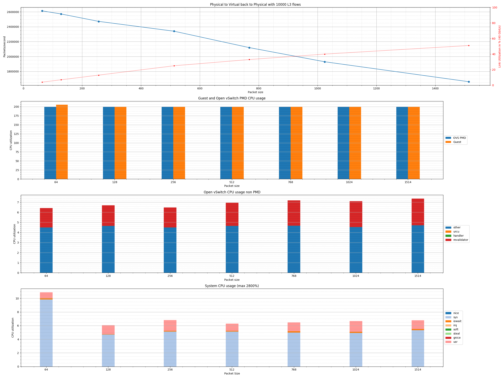
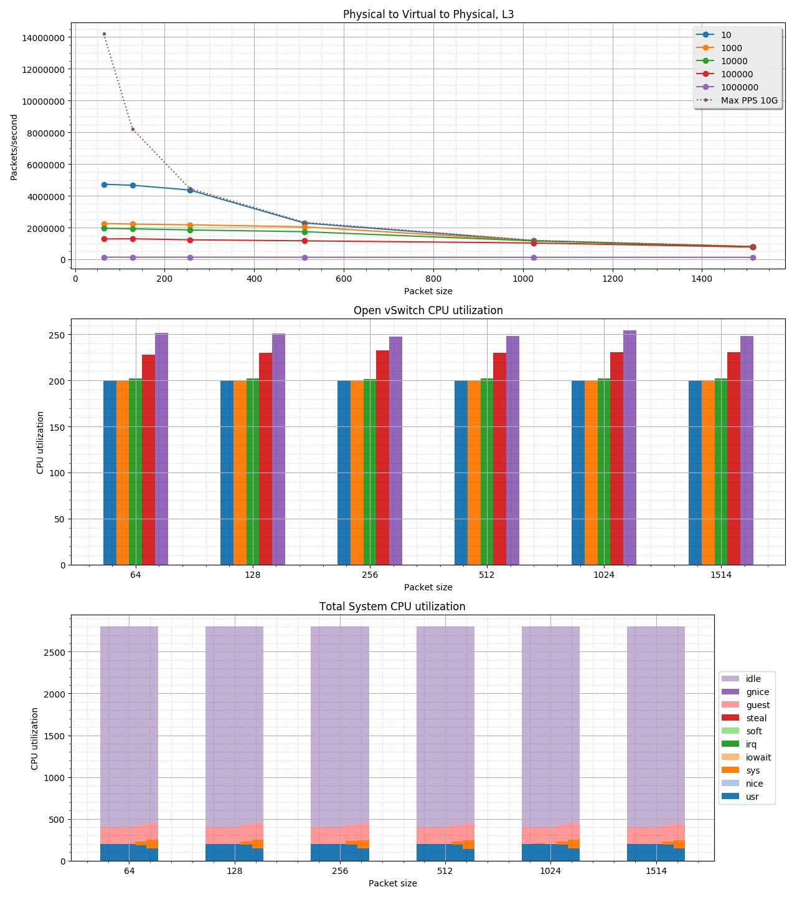

# Automated Open vSwitch PVP testing

The goal for this PVP script is to have a quick (and dirty) way to verify
the performance (change) of an Open vSwitch (DPDK) setup using the Physical to
Virtual back to Physical topology. This configuration is also known as the PVP
setup. The traffic will flow from a physical port to a virtual port on the
Virtual Machine(VM), and then back to the physical port. This script uses the
[TRex Realistic Traffic Generator](https://trex-tgn.cisco.com) for generating
and verifying the traffic.


For more details on the PVP test, take a look at the following blog post,
[Measuring and comparing Open vSwitch performance](https://developers.redhat.com/blog/2017/06/05/measuring-and-comparing-open-vswitch-performance/).


This setup tutorial needs two machines with Red Hat Enterprise Linux, in this
example, we use version 7.3. One machine will be used as a traffic generator
using TRex, the other one will be the DUT running Open vSwitch. We use two
Intel 82599ES 10G adapters to interconnect the machines. The script will take
care of performing the tests with different packet sizes, and set of different
traffic flows.


## Setup the TRex traffic generator

One of the two machines we will use for the TRex traffic generator. We will
also use this machine to run the actual PVP script, so some additional setup
steps are related to this.


Please check out the [TRex Installation Manual](https://trex-tgn.cisco.com/trex/doc/trex_manual.html#_download_and_installation)
for the minimal system requirements to run TRex. For example having a Haswell
or newer CPU. Also, do not forget to enable VT-d in the BIOS


### Register Red Hat Enterprise Linux
We continue here right after installing Red Hat Enterprise Linux. First need to
register the system, so we can download all the packages we need:

```
# subscription-manager register
Registering to: subscription.rhsm.redhat.com:443/subscription
Username: user@domain.com
Password:
The system has been registered with ID: xxxxxxxx-xxxx-xxxx-xxxxxxxxxxxxxxxxxx

# subscription-manager attach --pool=xxxxxxxxxxxxxxxxxxxxxxxxxxxxxxxx
Successfully attached a subscription for: xxxxxxxxxxxxxxxxxx
```


### Install the packages we need
Add the epel repository for some of the python packages:

```
yum -y install https://dl.fedoraproject.org/pub/epel/epel-release-latest-7.noarch.rpm
```


Now we can install the packages we need:

```
yum -y clean all
yum -y update
yum -y install lshw emacs gcc git pciutils python-devel python-setuptools python-pip \
               tmux tuned-profiles-cpu-partitioning wget
```


### Tweak the kernel
Rather than using the default 2M huge pages we configure 32 1G pages. You can
adjust this to your system's specifications. In this step we also enable iommu
needed by some of the DPDK PMD drivers used by TRex:

```
sed -i -e 's/GRUB_CMDLINE_LINUX="/GRUB_CMDLINE_LINUX="default_hugepagesz=1G hugepagesz=1G hugepages=32 iommu=pt intel_iommu=on /'  /etc/default/grub
grub2-mkconfig -o /boot/grub2/grub.cfg
```


### Download and installation of TRex
Download and unpack the TRex traffic generator:

```
mkdir trex
cd trex
wget http://trex-tgn.cisco.com/trex/release/v2.29.tar.gz
tar -xvzf v2.29.tar.gz
cd v2.29
```

Figure out PCI address of the card we would like to use, using the _lshw_
utility:

```
# lshw -c network -businfo
Bus info          Device     Class          Description
=======================================================
pci@0000:01:00.0  em1        network        82599ES 10-Gigabit SFI/SFP+ Network
pci@0000:01:00.1  em2        network        82599ES 10-Gigabit SFI/SFP+ Network
pci@0000:07:00.0  em3        network        I350 Gigabit Network Connection
pci@0000:07:00.1  em4        network        I350 Gigabit Network Connection
```

In our case, we will use em1, so PCI 0000:01:00.0. However as TRex likes
port pairs, we will also assign em2, 0000:01:00.1, to TRex.

__NOTE__: Make sure your network card has a kernel driver loaded, i.e. has a
_Device_ name in the output above, or else configuration in the step below
might fail.


Next step is to configure TRex:

```
# cd ~/trex/v2.29
# ./dpdk_setup_ports.py -i
By default, IP based configuration file will be created. Do you want to use MAC based config? (y/N)y
+----+------+---------+-------------------+------------------------------------------------+-----------+-----------+----------+
| ID | NUMA |   PCI   |        MAC        |                      Name                      |  Driver   | Linux IF  |  Active  |
+====+======+=========+===================+================================================+===========+===========+==========+
| 0  | 0    | 01:00.0 | 24:6e:96:3c:4b:c0 | 82599ES 10-Gigabit SFI/SFP+ Network Connection | ixgbe     | em1       |          |
+----+------+---------+-------------------+------------------------------------------------+-----------+-----------+----------+
| 1  | 0    | 01:00.1 | 24:6e:96:3c:4b:c2 | 82599ES 10-Gigabit SFI/SFP+ Network Connection | ixgbe     | em2       |          |
+----+------+---------+-------------------+------------------------------------------------+-----------+-----------+----------+
| 2  | 0    | 07:00.0 | 24:6e:96:3c:4b:c4 | I350 Gigabit Network Connection                | igb       | em3       | *Active* |
+----+------+---------+-------------------+------------------------------------------------+-----------+-----------+----------+
| 3  | 0    | 07:00.1 | 24:6e:96:3c:4b:c5 | I350 Gigabit Network Connection                | igb       | em4       |          |
+----+------+---------+-------------------+------------------------------------------------+-----------+-----------+----------+
Please choose even number of interfaces from the list above, either by ID , PCI or Linux IF
Stateful will use order of interfaces: Client1 Server1 Client2 Server2 etc. for flows.
Stateless can be in any order.
Enter list of interfaces separated by space (for example: 1 3) : 0 1

For interface 0, assuming loopback to it's dual interface 1.
Destination MAC is 24:6e:96:3c:4b:c2. Change it to MAC of DUT? (y/N).
For interface 1, assuming loopback to it's dual interface 0.
Destination MAC is 24:6e:96:3c:4b:c0. Change it to MAC of DUT? (y/N).
Print preview of generated config? (Y/n)y
### Config file generated by dpdk_setup_ports.py ###

- port_limit: 2
  version: 2
  interfaces: ['01:00.0', '01:00.1']
  port_info:
      - dest_mac: 24:6e:96:3c:4b:c2 # MAC OF LOOPBACK TO IT'S DUAL INTERFACE
        src_mac:  24:6e:96:3c:4b:c0
      - dest_mac: 24:6e:96:3c:4b:c0 # MAC OF LOOPBACK TO IT'S DUAL INTERFACE
        src_mac:  24:6e:96:3c:4b:c2

  platform:
      master_thread_id: 0
      latency_thread_id: 27
      dual_if:
        - socket: 0
          threads: [1,2,3,4,5,6,7,8,9,10,11,12,13,14,15,16,17,18,19,20,21,22,23,24,25,26]


Save the config to file? (Y/n)y
Default filename is /etc/trex_cfg.yaml
Press ENTER to confirm or enter new file:
Saved to /etc/trex_cfg.yaml.
```

As we would like to run the performance script on this machine, we decided
to not dedicate all CPUs to TRex. Below you see what we changed in the
/etc/trex_cfg.yaml file to exclude threads 1-3:

```
17c17
<           threads: [1,2,3,4,5,6,7,8,9,10,11,12,13,14,15,16,17,18,19,20,21,22,23,24,25,26]
---
>           threads: [4,5,6,7,8,9,10,11,12,13,14,15,16,17,18,19,20,21,22,23,24,25,26]
```


### Tweak the system for TRex usage
We know which threads will be used by TRex, let's dedicate them to this task.
We do this by applying the cpu-partitioning profile and configure the isolated
core mask:

```
systemctl enable tuned
systemctl start tuned
echo isolated_cores=4,5,6,7,8,9,10,11,12,13,14,15,16,17,18,19,20,21,22,23,24,25,26 >> /etc/tuned/cpu-partitioning-variables.conf
tuned-adm profile cpu-partitioning
```

Now it's time to reboot the machine to active the isolated cores and use the
configured 1G huge pages:

```
# reboot
```


### Start the TRex server
Now we're ready to start the TRex server in a tmux session, so we can look at
the console if we want to:

```
cd ~/trex/v2.29
tmux
./t-rex-64 -c 4 -i
```


## Setup the TRex host to run the actual PVP script
As our TRex machine has enough resources to also run the PVP script we decided
to run it there. However, in theory, you can run the PVP script on a third
machine or even the DUT. But make sure to keep the machine close to the
traffic generator, as it needs to communicate with it to capture statistics.

### Install the PVP scripts
First, we need to install the script on the machine:

```
git clone https://github.com/chaudron/ovs_perf.git
```


### Install additional packages needed by the PVP script
We need to install a bunch of Python libraries we need for the PVP script.
We will use pip to do this:

```
pip install --upgrade enum34 natsort netaddr matplotlib scapy spur
```


We also need the Xena Networks traffic generator libraries:

```
cd ~
git clone https://github.com/fleitner/XenaPythonLib
cd XenaPythonLib/
python setup.py install
```


Finally we need to install the TRex stateless libraries:

```
cd ~/trex/v2.29
tar -xzf trex_client_v2.29.tar.gz
cp -r trex_client/stl/trex_stl_lib/ ~/ovs_perf
cp -r trex_client/external_libs/ ~/ovs_perf/trex_stl_lib/

```


## Setup the Device Under Test (DUT), Open vSwitch
<a name="DUTsetup"/>

For this tutorial, we use Open vSwitch in combination with the DPDK,
userspace datapath. At the end of this document, we also explain how to
redo the configuration to use the Linux kernel datapath.


### Register Red Hat Enterprise Linux
As with the TRex system we first need to register the system:

```
# subscription-manager register
Registering to: subscription.rhsm.redhat.com:443/subscription
Username: user@domain.com
Password:
The system has been registered with ID: xxxxxxxx-xxxx-xxxx-xxxxxxxxxxxxxxxxxx

# subscription-manager attach --pool=xxxxxxxxxxxxxxxxxxxxxxxxxxxxxxxx
Successfully attached a subscription for: xxxxxxxxxxxxxxxxxx
```


### Add the packages we need
We need _"Red Hat Enterprise Linux Fast Datapath 7"_ for Open vSwitch,
and _"Red Hat Virtualization 4"_ for Qemu. If you do not have access to these
repositories, please contact your Red Had representative.

```
subscription-manager repos --enable=rhel-7-fast-datapath-rpms
subscription-manager repos --enable=rhel-7-server-rhv-4-mgmt-agent-rpms
subscription-manager repos --enable rhel-7-server-extras-rpms
subscription-manager repos --enable rhel-7-server-optional-rpms
```

__NOTE__: If the above gives an error, follow procedure at: https://access.redhat.com/solutions/3006821, basically:

```
subscription-manager unsubscribe --all
yum clean all
subscription-manager attach
subscription-manager repos --disable="*"
subscription-manager repos \
--enable="rhel-7-server-extras-rpms" \
--enable="rhel-7-fast-datapath-rpms"
```


Add the epel repository for sshpass and others:

```
yum -y install https://dl.fedoraproject.org/pub/epel/epel-release-latest-7.noarch.rpm
```


Now we can install the packages we need:

```
yum -y clean all
yum -y update
yum -y install aspell aspell-en autoconf automake bc checkpolicy \
               desktop-file-utils driverctl emacs gcc gcc-c++ gdb git graphviz \
               groff hwloc intltool kernel-devel libcap-ng libcap-ng-devel \
               libguestfs libguestfs-tools-c libtool libvirt lshw openssl \
               openssl-devel openvswitch procps-ng python python-six \
               python-twisted-core python-zope-interface qemu-kvm-rhev \
               rpm-build selinux-policy-devel sshpass sysstat systemd-units \
               tcpdump time tmux tuned-profiles-cpu-partitioning \
               virt-install virt-manager wget
```


### Tweak the system for OVS-DPDK and Qemu usage
There is work in progress for Open vSwitch DPDK to play nicely with SELinux,
but for now, the easiest way is to disable it:

```
sed -i -e 's/SELINUX=enforcing/SELINUX=permissive/' /etc/selinux/config
setenforce permissive
```


Rather than using the default 2M huge pages we configure 32 1G pages. You can
adjust this to your system's specifications. In this step we also enable iommu
needed by the DPDK PMD driver:

```
sed -i -e 's/GRUB_CMDLINE_LINUX="/GRUB_CMDLINE_LINUX="default_hugepagesz=1G hugepagesz=1G hugepages=32 iommu=pt intel_iommu=on/'  /etc/default/grub
grub2-mkconfig -o /boot/grub2/grub.cfg
```


Our system is a single NUMA node using Hyper-Threading and we would like to
use the first Hyper-Threading pair for system usage. The remaining threads
we would like dedicate to Qemu and Open vSwitch.


__NOTE__ that if you have a multi-NUMA system the cores you assign to both Open
vSwitch and Qemu need to be one same NUMA node as the network card. For some
more background information on this see the [OVS-DPDK Parameters: Dealing with
multi-NUMA](https://developers.redhat.com/blog/2017/06/28/ovs-dpdk-parameters-dealing-with-multi-numa/)
blog post.


To figure out the numbers of threads, and the first thread pair we execute
the following:

```
# lscpu |grep -E "^CPU\(s\)|On-line|Thread\(s\) per core"
CPU(s):                28
On-line CPU(s) list:   0-27
Thread(s) per core:    2

# lstopo-no-graphics
Machine (126GB)
  Package L#0 + L3 L#0 (35MB)
    L2 L#0 (256KB) + L1d L#0 (32KB) + L1i L#0 (32KB) + Core L#0
      PU L#0 (P#0)
      PU L#1 (P#14)
    L2 L#1 (256KB) + L1d L#1 (32KB) + L1i L#1 (32KB) + Core L#1
      PU L#2 (P#1)
      PU L#3 (P#15)
    L2 L#2 (256KB) + L1d L#2 (32KB) + L1i L#2 (32KB) + Core L#2
      ...
      ...
```


Now we apply the cpu-partitioning profile, and configure the isolated
core mask:

```
systemctl enable tuned
systemctl start tuned
echo isolated_cores=1-13,15-27 >> /etc/tuned/cpu-partitioning-variables.conf
tuned-adm profile cpu-partitioning
```
<a name="isolcpus"/>

In addition, we would also like to remove these CPUs from the  SMP balancing
and scheduler algroithms. With the tuned cpu-partitioning starting with version
2.9.0-1 this can be done with the no_balance_cores= option. As this is not yet
available to us, we have to do this using the isolcpus option on the kernel
command line. This can be done as follows:

```
sed -i -e 's/GRUB_CMDLINE_LINUX="/GRUB_CMDLINE_LINUX="isolcpus=1-13,15-27 /'  /etc/default/grub
grub2-mkconfig -o /boot/grub2/grub.cfg
```


Now it's time to reboot the machine to active the isolated cores, and use the
configured 1G huge pages:

```
# reboot
...
# cat /proc/cmdline
BOOT_IMAGE=/vmlinuz-3.10.0-693.1.1.el7.x86_64 root=/dev/mapper/rhel_wsfd--netdev67-root ro default_hugepagesz=1G hugepagesz=1G hugepages=4 crashkernel=auto rd.lvm.lv=rhel_wsfd-netdev67/root rd.lvm.lv=rhel_wsfd-netdev67/swap console=ttyS1,115200 nohz=on nohz_full=1-13,15-27 rcu_nocbs=1-13,15-27 tuned.non_isolcpus=00004001 intel_pstate=disable nosoftlockup
```


### Setup Open vSwitch
In the Open vSwitch DPDK configuration the physical interface is under direct
control of DPDK, hence it needs to be removed from the kernel. To do this
we first need to figure out the interface's PCI address. An easy way of doing
this is using the _lshw_ utility:

```
# lshw -c network -businfo
Bus info          Device      Class          Description
========================================================
pci@0000:01:00.0  em1         network        82599ES 10-Gigabit SFI/SFP+ Network Connection
pci@0000:01:00.1  em2         network        82599ES 10-Gigabit SFI/SFP+ Network Connection
pci@0000:07:00.0  em3         network        I350 Gigabit Network Connection
pci@0000:07:00.1  em4         network        I350 Gigabit Network Connection
```


For our performance test, we would like to use the 10GbE interface _em1_. You
could use the _dpdk-devbind_ utility to bind the interface to DPDK, however,
this configuration will not survive a reboot. The preferred solution is to use
_driverctl_:

```
# driverctl -v set-override 0000:01:00.0 vfio-pci
driverctl: setting driver override for 0000:01:00.0: vfio-pci
driverctl: loading driver vfio-pci
driverctl: unbinding previous driver ixgbe
driverctl: reprobing driver for 0000:01:00.0
driverctl: saving driver override for 0000:01:00.0

# lshw -c network -businfo
Bus info          Device      Class          Description
========================================================
pci@0000:01:00.0              network        82599ES 10-Gigabit SFI/SFP+ Network Connection
pci@0000:01:00.1  em2         network        82599ES 10-Gigabit SFI/SFP+ Network Connection
pci@0000:07:00.0  em3         network        I350 Gigabit Network Connection
pci@0000:07:00.1  em4         network        I350 Gigabit Network Connection

```


Start Open vSwitch, and automatically start it after every reboot:

```
systemctl enable openvswitch
systemctl start openvswitch
```


For OVS-DPDK we would like to use the second Hyper Thread pair (CPU 1,15) for
the PMD threads. And the third Hyper Thread pair (CPU 2,16) for the none PMD
DPDK threads. To configure this we execute the following commands:

```
ovs-vsctl set Open_vSwitch . other_config:dpdk-init=true
ovs-vsctl set Open_vSwitch . other_config:dpdk-socket-mem=2048
ovs-vsctl set Open_vSwitch . other_config:pmd-cpu-mask=0x00008002
ovs-vsctl set Open_vSwitch . other_config:dpdk-lcore-mask=0x00010004
systemctl restart openvswitch
```

For the Physical to Virtual back to Physical(PVP) test we only need one bridge
with two ports. In addition, we will configure our interfaces with 2 receive
queues:

```
ovs-vsctl --if-exists del-br ovs_pvp_br0
ovs-vsctl add-br ovs_pvp_br0 -- \
          set bridge ovs_pvp_br0 datapath_type=netdev
ovs-vsctl add-port ovs_pvp_br0 dpdk0 -- \
          set Interface dpdk0 type=dpdk -- \
          set Interface dpdk0 options:dpdk-devargs=0000:01:00.0 -- \
          set interface dpdk0 options:n_rxq=2 \
            other_config:pmd-rxq-affinity="0:1,1:15" -- \
          set Interface dpdk0 ofport_request=1
ovs-vsctl add-port ovs_pvp_br0 vhost0 -- \
          set Interface vhost0 type=dpdkvhostuserclient -- \
          set Interface vhost0 options:vhost-server-path="/tmp/vhost-sock0" -- \
          set interface vhost0 options:n_rxq=2 \
            other_config:pmd-rxq-affinity="0:1,1:15" -- \
          set Interface vhost0 ofport_request=2
```


### Create the loopback Virtual Machine
<a name="CreateLoopbackVM"/>

Get the [Red Hat Enterprise Linux 7.5 KVM Guest Image](https://access.redhat.com/downloads/content/69/ver=/rhel---7/7.5/x86_64/product-software).
If you do not have access to the image please contact your Red Had
representative. Copy the image for use by qemu:

```
# ls -l ~/*.qcow2
-rw-r--r--. 1 root root 556247552 Jul 13 06:10 rhel-server-7.5-x86_64-kvm.qcow2
```
```
mkdir -p /opt/images
cp ~/rhel-server-7.5-x86_64-kvm.qcow2 /opt/images
```


Start and enable libvirtd:

```
systemctl enable libvirtd.service
systemctl start libvirtd.service
```


Setup as much as possible with a single call to _virt-install_:

```
# virt-install --connect=qemu:///system \
  --network vhostuser,source_type=unix,source_path=/tmp/vhost-sock0,source_mode=server,model=virtio,driver_queues=2 \
  --network network=default \
  --name=rhel_loopback \
  --disk path=/opt/images/rhel-server-7.5-x86_64-kvm.qcow2,format=qcow2 \
  --ram 8192 \
  --memorybacking hugepages=on,size=1024,unit=M,nodeset=0 \
  --vcpus=4,cpuset=3,4,5,6 \
  --check-cpu \
  --cpu Haswell-noTSX,+pdpe1gb,cell0.id=0,cell0.cpus=0,cell0.memory=8388608 \
  --numatune mode=strict,nodeset=0 \
  --nographics --noautoconsole \
  --import \
  --os-variant=rhel7
```

If you have a multi-NUMA system and you are not on NUMA node 0, you need to
change the _nodeset_ values above accordingly.


Note that we have been using cores 1,2,15,16 for OVS, and above we have assigned
cores 3-6 to the loopback Virtual Machine (VM). For optimal performance we need
to pin the vCPUs to real CPUs. In addition, we will also assign an additional
core for Qemu related task to make sure they will not interrupt any PMD threads
running in the VM:

```
virsh vcpupin rhel_loopback 0 3
virsh vcpupin rhel_loopback 1 4
virsh vcpupin rhel_loopback 2 5
virsh vcpupin rhel_loopback 3 6
virsh emulatorpin rhel_loopback 7
```

We need to tweak some Virtual Machine profile settings manually, as not all
options are available through _virt-install_. This is related to memory sharing,
and pinning of the Virtual Machine to dedicated CPUs (the above commands will
no survive a reboot). We will do this using _virsh edit_. Below are the
commands used, and the diff of the applied changes:

```
# virsh shutdown rhel_loopback
# virsh edit rhel_loopback

diff:
@@ -18,2 +18,9 @@
   <vcpu placement='static' cpuset='3-6'>4</vcpu>
+  <cputune>
+    <vcpupin vcpu='0' cpuset='3'/>
+    <vcpupin vcpu='1' cpuset='4'/>
+    <vcpupin vcpu='2' cpuset='5'/>
+    <vcpupin vcpu='3' cpuset='6'/>
+    <emulatorpin cpuset='7'/>
+  </cputune>
   <numatune>
@@ -33,3 +40,3 @@
     <numa>
-      <cell id='0' cpus='0' memory='8388608' unit='KiB'/>
+      <cell id='0' cpus='0' memory='8388608' unit='KiB' memAccess='shared'/>
     </numa>
```


Tweak the virtual machine such that it will have the interfaces named trough
network manager, and the cloud configuration removed on the next boot:

```
# LIBGUESTFS_BACKEND=direct virt-customize -d rhel_loopback \
  --root-password password:root \
  --firstboot-command 'rm /etc/systemd/system/multi-user.target.wants/cloud-config.service' \
  --firstboot-command 'rm /etc/systemd/system/multi-user.target.wants/cloud-final.service' \
  --firstboot-command 'rm /etc/systemd/system/multi-user.target.wants/cloud-init-local.service' \
  --firstboot-command 'rm /etc/systemd/system/multi-user.target.wants/cloud-init.service' \
  --firstboot-command 'nmcli c | grep -o --  "[0-9a-fA-F]\{8\}-[0-9a-fA-F]\{4\}-[0-9a-fA-F]\{4\}-[0-9a-fA-F]\{4\}-[0-9a-fA-F]\{12\}" | xargs -n 1 nmcli c delete uuid' \
  --firstboot-command 'nmcli con add con-name ovs-dpdk ifname eth0 type ethernet ip4 1.1.1.1/24' \
  --firstboot-command 'nmcli con add con-name management ifname eth1 type ethernet' \
  --firstboot-command 'reboot'
```


Start the VM, and attach to the console:

```
# virsh start rhel_loopback
Domain rhel_loopback started

# virsh console rhel_loopback
Connected to domain rhel_loopback
Escape character is ^]

[root@localhost ~]#
```


The VM needs the same tweaking as the OVS-DPDK instance. Below is a quick
command sequence that needs to be executed on the VM. For details see the
beginning of the [Setup the Device Under Test (DUT), Open vSwitch](#DUTsetup)
section above:

```
[root@localhost ~]# subscription-manager register
[root@localhost ~]# subscription-manager attach --pool=xxxxxxxxxxxxxxxxxxxxxxxxx
[root@localhost ~]# subscription-manager repos --enable=rhel-7-fast-datapath-rpms
[root@localhost ~]# yum -y clean all
[root@localhost ~]# yum -y update
[root@localhost ~]# yum -y install driverctl gcc kernel-devel numactl-devel tuned-profiles-cpu-partitioning wget
[root@localhost ~]# yum -y update kernel
[root@localhost ~]# sed -i -e 's/GRUB_CMDLINE_LINUX="/GRUB_CMDLINE_LINUX="isolcpus=1,2,3 default_hugepagesz=1G hugepagesz=1G hugepages=2 /'  /etc/default/grub
[root@localhost ~]# grub2-mkconfig -o /boot/grub2/grub.cfg
[root@localhost ~]# echo "options vfio enable_unsafe_noiommu_mode=1" > /etc/modprobe.d/vfio.conf
[root@localhost ~]# driverctl -v set-override 0000:00:02.0 vfio-pci
[root@localhost ~]# systemctl enable tuned
[root@localhost ~]# systemctl start tuned
[root@localhost ~]# echo isolated_cores=1,2,3 >> /etc/tuned/cpu-partitioning-variables.conf
[root@localhost ~]# tuned-adm profile cpu-partitioning
[root@localhost ~]# reboot
```

__NOTE__: If the above registration for the _rhel-7-fast-datapath-rpms_ gives an error, follow procedure at: https://access.redhat.com/solutions/3006821, basically:

```
subscription-manager unsubscribe --all
yum clean all
subscription-manager attach
subscription-manager repos --disable="*"
subscription-manager repos \
--enable="rhel-7-server-extras-rpms" \
--enable="rhel-7-fast-datapath-rpms"
```


We need the _testpmd_ tool from DPDK on this VM. As an exercise we build it
from source:

```
[root@localhost ~]# cd ~
[root@localhost ~]# wget http://fast.dpdk.org/rel/dpdk-17.08.tar.xz
[root@localhost ~]# tar xf dpdk-17.08.tar.xz
[root@localhost ~]# cd dpdk-17.08
[root@localhost dpdk-17.08]# make install T=x86_64-native-linuxapp-gcc DESTDIR=_install
[root@localhost dpdk-17.08]# ln -s /root/dpdk-17.08/x86_64-native-linuxapp-gcc/app/testpmd /usr/bin/testpmd
```

You can quickly check if your VM is setup correctly by starting _testpmd_
as follows:

```
[root@localhost dpdk-17.08]# cd ~
[root@localhost dpdk-17.08]# testpmd -c 0x7 -n 4 --socket-mem 1024,0 -w 0000:00:02.0 -- \
  --burst 64 --disable-hw-vlan -i --rxq=2 --txq=2 \
  --rxd=4096 --txd=1024 --coremask=0x6 --auto-start \
  --port-topology=chained

EAL: Detected 4 lcore(s)
EAL: Probing VFIO support...
EAL: WARNING: cpu flags constant_tsc=yes nonstop_tsc=no -> using unreliable clock cycles !
EAL: PCI device 0000:00:02.0 on NUMA socket -1
EAL:   Invalid NUMA socket, default to 0
EAL:   probe driver: 1af4:1000 net_virtio
Interactive-mode selected
previous number of forwarding cores 1 - changed to number of configured cores 2
Auto-start selected
USER1: create a new mbuf pool <mbuf_pool_socket_0>: n=163456, size=2176, socket=0
Configuring Port 0 (socket 0)
Port 0: 52:54:00:70:39:86
Checking link statuses...
Done
Start automatic packet forwarding
io packet forwarding - ports=1 - cores=2 - streams=2 - NUMA support enabled, MP over anonymous pages disabled
Logical Core 1 (socket 0) forwards packets on 1 streams:
  RX P=0/Q=0 (socket 0) -> TX P=0/Q=0 (socket 0) peer=02:00:00:00:00:00
Logical Core 2 (socket 0) forwards packets on 1 streams:
  RX P=0/Q=1 (socket 0) -> TX P=0/Q=1 (socket 0) peer=02:00:00:00:00:00

  io packet forwarding - CRC stripping enabled - packets/burst=64
  nb forwarding cores=2 - nb forwarding ports=1
  RX queues=2 - RX desc=4096 - RX free threshold=0
  RX threshold registers: pthresh=0 hthresh=0 wthresh=0
  TX queues=2 - TX desc=1024 - TX free threshold=0
  TX threshold registers: pthresh=0 hthresh=0 wthresh=0
  TX RS bit threshold=0 - TXQ flags=0xf00
testpmd> quit
Telling cores to stop...
Waiting for lcores to finish...

  ---------------------- Forward statistics for port 0  ----------------------
  RX-packets: 0              RX-dropped: 0             RX-total: 0
  TX-packets: 0              TX-dropped: 0             TX-total: 0
  ----------------------------------------------------------------------------

  +++++++++++++++ Accumulated forward statistics for all ports+++++++++++++++
  RX-packets: 0              RX-dropped: 0             RX-total: 0
  TX-packets: 0              TX-dropped: 0             TX-total: 0
  ++++++++++++++++++++++++++++++++++++++++++++++++++++++++++++++++++++++++++++

Done.

Shutting down port 0...
Stopping ports...
Done
Closing ports...
Done

Bye...

Shutting down port 0...
Stopping ports...
Done
Closing ports...
Port 0 is already closed
Done

Bye...
[root@localhost ~]#
```

Finally get the IP address assigned to this VM, as we need it later when
executing the PVP script.

```
[root@localhost ~]# ip address show eth1
3: eth1: <BROADCAST,MULTICAST,UP,LOWER_UP> mtu 1500 qdisc pfifo_fast state UP qlen 1000
    link/ether 52:54:00:06:7e:0a brd ff:ff:ff:ff:ff:ff
    inet 192.168.122.5/24 brd 192.168.122.255 scope global dynamic eth1
       valid_lft 3590sec preferred_lft 3590sec
    inet6 fe80::1c38:e5d7:1687:d254/64 scope link
       valid_lft forever preferred_lft forever
```


## Running the PVP script

Now we are all set to run the PVP script. We move back to the TRex host as we
use this to execute the script.

Before we start we need to set the back-end to not use a GUI and create
a directory to store the results:

```
echo export MPLBACKEND="agg" >> ~/.bashrc
source ~/.bashrc
mkdir ~/pvp_results
cd ~/pvp_results/
```


Now we can do a quick 64 bytes packet run with 1000 flows to verify everything
has been set up correctly.

__NOTE:__ The PVP script assumes both machines are directly attached, i.e.
there is no switch in between. If you do have a switch in between the best
option is to disable learning. If this is not possible you need to use the
--mac-swap option. This will swap the MAC addresses on the VM side, so the
switch in the middle does not get confused.

For details on the supported PVP script options, see the
[ovs_performance.py Supported Options](#options) chapter.

```
# ~/ovs_perf/ovs_performance.py \
  -d -l testrun_log.txt \              # Enable script debugging, and save the output to testrun_log.txt
  --tester-type trex \                 # Set tester type to TRex
  --tester-address localhost \         # IP address of the TRex server
  --tester-interface 0 \               # Interface number used on the TRex
  --ovs-address 10.19.17.133 \         # DUT IP address
  --ovs-user root \                    # DUT login user name
  --ovs-password root \                # DUT login user password
  --dut-vm-address 192.168.122.5 \     # Address on which the VM is reachable, see above
  --dut-vm-user root \                 # VM login user name
  --dut-vm-password root \             # VM login user password
  --dut-vm-nic-queues=2 \              # Number of rx/tx queues to use on the VM
  --physical-interface dpdk0 \         # OVS Physical interface, i.e. connected to TRex
  --physical-speed=10 \                # Speed of the physical interface, for DPDK we can not detect it reliably
  --virtual-interface vhost0 \         # OVS Virtual interface, i.e. connected to the VM
  --dut-vm-nic-pci=0000:00:02.0 \      # PCI address of the interface in the VM
  --packet-list=64 \                   # Comma separated list of packets to test with
  --stream-list=1000 \                 # Comma separated list of number of flows/streams to test with
  --no-bridge-config \                 # Do not configure the OVS bridge, assume it's already done (see above)
  --skip-pv-test                       # Skip the Physical to Virtual test

- Connecting to the tester...
- Connecting to DUT, "10.19.17.133"...
- Stop any running test tools...
- Get OpenFlow and DataPath port numbers...
- Get OVS datapath type, "netdev"...
- Create "test_results.csv" for writing results...
- [TEST: test_p2v2p(flows=1000, packet_size=64)] START
  * Create OVS OpenFlow rules...
  * Clear all OpenFlow/Datapath rules on bridge "ovs_pvp_br0"...
  * Create 1000 L3 OpenFlow rules...
  * Create 1000 L3 OpenFlow rules...
  * Verify requested number of flows exists...
  * Initializing packet generation...
  * Clear all statistics...
  * Start packet receiver on VM...
  * Start CPU monitoring on DUT...
  * Start packet generation for 20 seconds...
  * Stop CPU monitoring on DUT...
  * Stopping packet stream...
  * Stop packet receiver on VM...
  * Gathering statistics...
    - Packets send by Tester      :          270,574,060
    - Packets received by physical:           44,172,736 [Lost 226,401,324, Drop 226,401,324]
    - Packets received by virtual :           44,172,290 [Lost 446, Drop 446]
    - Packets send by virtual     :           44,171,170 [Lost 1,120, Drop 0]
    - Packets send by physical    :           44,171,170 [Lost 0, Drop 0]
    - Packets received by Tester  :           44,171,170 [Lost 0]
    - Receive rate on VM: 2,319,236 pps
  ! Result, average: 2,254,424.93125 pps
  * Restoring state for next test...
- [TEST: test_p2v2p(flows=1000, packet_size=64)] END
- Done running performance tests!

```


If this is successful we can go ahead and do a full run.
Depending on the hardware configuration this will take around an hour:

```
rm -rf ~/pvp_results
mkdir ~/pvp_results
cd ~/pvp_results/
~/ovs_perf/ovs_performance.py \
  -d -l testrun_log.txt \
  --tester-type trex \
  --tester-address localhost \
  --tester-interface 0 \
  --ovs-address 10.19.17.133 \
  --ovs-user root \
  --ovs-password root \
  --dut-vm-address 192.168.122.5 \
  --dut-vm-user root \
  --dut-vm-password root \
  --dut-vm-nic-queues=2 \
  --physical-interface dpdk0 \
  --physical-speed=10 \
  --virtual-interface vhost0 \
  --dut-vm-nic-pci=0000:00:02.0 \
  --no-bridge-config \
  --skip-pv-test
```


## Analyzing the results

The full run above will generate the following files:

```
# ls | more
test_p2v2p_1000000_l3.png
test_p2v2p_100000_l3.png
test_p2v2p_10000_l3.png
test_p2v2p_1000_l3.png
test_p2v2p_10_l3.png
test_p2v2p_all_l3.png
test_p2v2p_all_l3_ref.png
test_results_l3.csv
testrun_log.txt
```

The ___test\_results\_l3.csv___ file has all the throughput numbers, and CPU utilization details. Below is an output example with the CPU data removed as it generates quite some noise:

```
# cat test_results_l3.csv | grep -v cpu
"Physical port, ""dpdk0"", speed 10 Gbit/s"


"Physical to Virtual to Physical test, L3 flows"
,Packet size
Number of flows,64,128,256,512,1024,1514
10,4727031.0,4667014.3125,4364770.8125,2287722.54375,1173820.56875,789753.2374999999
1000,2250850.53125,2220449.0625,2173334.875,2046172.8687500001,1163426.2874999999,792140.7312500001
10000,1953503.9875,1920673.01875,1850640.8375,1739899.65,1159738.70625,797117.66875
100000,1282826.4,1291901.2249999999,1230113.23125,1163795.4125,1027805.6124999999,771230.91875
1000000,135964.475,131447.69375,134586.19999999998,129209.65624999997,125609.67500000003,125875.18125000001
```

For every flow size a separate graph is created, ___test\_p2v2p\_xxx\_l3.png___,
in addition to two overall graphs. The ___test\_p2v2p\_all\_l3\_ref.png___
will show all flow sizes in one graph with the addition of the theoretical
maximum, the ___test\_p2v2p\_all\_l3.png___ does not show the theoretical
maximum.

Below you will find the content of the ___test\_p2v2p\_10000\_l3.png___ and
___test\_p2v2p\_all\_l3\_ref.png___ as an example.

#### ___test\_p2v2p\_10000\_l3.png___:


#### ___test\_p2v2p\_all\_l3\_ref.png___:



The following system configuration was used to gather these numbers and
create the graphs:

* Dell PowerEdge R730, single socket
* Intel Xenon E5-2690 v4 @ 2.60GHz
* 128G of system memory
* Intel 82599ES 10G adapter


## ovs_performance.py Supported Options
<a name="options"/>

The __ovs\_performance.py__ script options are straightforward, and the help is displayed below.

```
# ./ovs_performance.py --help
usage: ovs_performance.py [-h] [--bridge-name BRIDGE] [-d] [--debug-dut-shell]
                          [--debug-scapy] [--debug-script] [--debug-tester]
                          [--pmd-rxq-affinity AFINITY]
                          [--dut-vm-address ADDRESS] [--dut-vm-nic-pci PCI]
                          [--dut-vm-user USER] [--dut-vm-password PASSWORD]
                          [--dut-vm-nic-queues QUEUES]
                          [--dut-vm-nic-rxd DESCRIPTORS]
                          [--dut-vm-nic-txd DESCRIPTORS]
                          [--flow-type {L2,L3,L4-UDP}] [-g]
                          [--no-bridge-config] [-o ADDRESS] [--ovs-user USER]
                          [--ovs-password PASSWORD] [-p DEVICE] [--perf]
                          [--physical-interface-pci PCI]
                          [--second-physical-interface DEVICE]
                          [--second-physical-interface-pci PCI]
                          [--physical-speed GBPS] [--packet-list LIST]
                          [-r SECONDS] [--run-pp-test] [--skip-pv-test]
                          [--skip-pvp-test] [--stream-list LIST] [--warm-up]
                          [--warm-up-timeout SECONDS] [--warm-up-no-fail]
                          [--no-cool-down] [-v DEVICE] [-x ADDRESS]
                          [--tester-type {xena,trex}] [-i {MOD,}PORT]
                          [--second-tester-interface {MOD,}PORT] [-l FILE]
                          [--dst-mac-address DST_MAC_ADDRESS]
                          [--src-mac-address SRC_MAC_ADDRESS] [--mac-swap]

optional arguments:
  -h, --help            show this help message and exit
  --bridge-name BRIDGE  Bridge name to use for testing
  -d, --debug           Enable debugging
  --debug-dut-shell     Enable DUT shell debugging
  --debug-scapy         Enable scapy debugging
  --debug-script        Enable script debugging
  --debug-tester        Enable tester debugging
  --pmd-rxq-affinity AFINITY
                        Set pmd-rxq-affinity when script configures bridges
  --dut-vm-address ADDRESS
                        IP address of VM running on OpenVSwitch DUT
  --dut-vm-nic-pci PCI  PCI address of VMs virtual NIC
  --dut-vm-user USER    User name of VM running on OpenVSwitch DUT
  --dut-vm-password PASSWORD
                        User name of VM running on OpenVSwitch DUT
  --dut-vm-nic-queues QUEUES
                        Number of VM nic queues (and cores) to allocate,
                        default 1
  --dut-vm-nic-rxd DESCRIPTORS
                        Number of VM nic receive descriptors, default 4096
  --dut-vm-nic-txd DESCRIPTORS
                        Number of VM nic transmit descriptors, default 1024
  --flow-type {L2,L3,L4-UDP}
                        Flow type used for the tests, default L3
  -g, --gui             Show graph GUI
  --no-bridge-config    Do not configure OVS
  -o ADDRESS, --ovs-address ADDRESS
                        IP address of OpenVSwitch DUT
  --ovs-user USER       User name of OpenVSwitch DUT
  --ovs-password PASSWORD
                        User name of OpenVSwitch DUT
  -p DEVICE, --physical-interface DEVICE
                        Physical interface
  --perf                Enable perf profiling
  --physical-interface-pci PCI
                        Physical interface's PCI address
  --second-physical-interface DEVICE
                        Second Physical interface
  --second-physical-interface-pci PCI
                        Second Physical interface
  --physical-speed GBPS
                        Physical interface speed in Gbit/s
  --packet-list LIST    List of packet sizes to test
  -r SECONDS, --run-time SECONDS
                        Traffic run time per test
  --run-pp-test         Run the P to P test
  --skip-pv-test        Do not run the P to V test
  --skip-pvp-test       Do not run the P to V to P test
  --stream-list LIST    List of stream sizes to test
  --warm-up             Do flow warm-up round before tests
  --warm-up-timeout SECONDS
                        Warm up timeout
  --warm-up-no-fail     Continue running the test even if warm up times out
  --no-cool-down        Do not wait for datapath flows to be cleared
  -v DEVICE, --virtual-interface DEVICE
                        Virtual interface
  -x ADDRESS, --tester-address ADDRESS
                        IP address of network tester
  --tester-type {xena,trex}
                        Traffic tester type to use, default "xena"
  -i {MOD,}PORT, --tester-interface {MOD,}PORT
                        Tester interface
  --second-tester-interface {MOD,}PORT
                        Second tester interface
  -l FILE, --logging FILE
                        Redirecting log output to file
  --dst-mac-address DST_MAC_ADDRESS
                        Destination Base MAC address
  --src-mac-address SRC_MAC_ADDRESS
                        Source Base MAC address
  --mac-swap            Swap source/destination mac at VM
```

__NOTES:__
* By default the script will also execute the Physical to Virtual test, i.e. the
traffic is not looped back to the Physical port. To avoid this use the
_--skip-pv-test_ option.
* The _--warm-up_ option will send out traffic before each iteration of a
test and
makes sure the data path flows exists before starting the actual throughput test.
* Flow type L4-UDP is not supported with TRex yet.
* The Physical to Physical setup is supported but has only been tested with
Xena traffic generator.


## Building Open vSwitch with DPDK from scratch

Building Open vSwitch from scratch and use it for testing should be rather straightforward. The below example assumes you have Open vSwitch running as explained above.

First download the specific DPDK version we would like to use, and build it:

```
mkdir -p /usr/src
cd /usr/src
wget http://fast.dpdk.org/rel/dpdk-17.05.1.tar.xz
tar xf dpdk-17.05.1.tar.xz
echo "export DPDK_DIR=/usr/src/dpdk-stable-17.05.1" >> ~/.bashrc
echo "export DPDK_TARGET=x86_64-native-linuxapp-gcc" >> ~/.bashrc
echo "export DPDK_BUILD=\$DPDK_DIR/\$DPDK_TARGET" >> ~/.bashrc
source ~/.bashrc
cd $DPDK_DIR
time make -j 20 install T=$DPDK_TARGET DESTDIR=install 2>&1 | tee dpdk.compile--`date +%Y-%m-%d--%H:%M:%S`
```

Secondly download Open vSwitch and build it:

```
cd /usr/src
git clone https://github.com/openvswitch/ovs.git ovs_github
cd ovs_github/
git checkout v2.8.0
./boot.sh 2>&1 | tee ovs.boot--`date +%Y-%m-%d--%H:%M:%S`
./configure --enable-Werror \
  --prefix=/usr --localstatedir=/var --sysconfdir=/etc \
  --with-dpdk=$DPDK_BUILD 2>&1 | tee ovs.configure--`date +%Y-%m-%d--%H:%M:%S`

make -j `nproc` 2>&1 | tee ovs.compile--`date +%Y-%m-%d--%H:%M:%S`
make install 2>&1 | tee ovs.install--`date +%Y-%m-%d--%H:%M:%S`

```
As the "_make install_" above will overwrite the installed binaries by the
yum package, all that needs to be done is restarting OVS.

```
# ovs-vsctl show
5b334fb3-7447-46c4-900b-db78d8fc5a96
    Bridge "ovs_pvp_br0"
        Port "vhost0"
            Interface "vhost0"
                type: dpdkvhostuserclient
                options: {n_rxq="2", vhost-server-path="/tmp/vhost-sock0"}
        Port "ovs_pvp_br0"
            Interface "ovs_pvp_br0"
                type: internal
        Port "dpdk0"
            Interface "dpdk0"
                type: dpdk
                options: {dpdk-devargs="0000:01:00.0", n_rxq="2"}
    ovs_version: "2.7.2"

# systemctl restart openvswitch

# ovs-vsctl show
5b334fb3-7447-46c4-900b-db78d8fc5a96
    Bridge "ovs_pvp_br0"
        Port "vhost0"
            Interface "vhost0"
                type: dpdkvhostuserclient
                options: {n_rxq="2", vhost-server-path="/tmp/vhost-sock0"}
        Port "ovs_pvp_br0"
            Interface "ovs_pvp_br0"
                type: internal
        Port "dpdk0"
            Interface "dpdk0"
                type: dpdk
                options: {dpdk-devargs="0000:01:00.0", n_rxq="2"}
    ovs_version: "2.8.0"
```

To verify the setup is still working, rerun the quick 64 bytes packet run with 1000 flows.


## Full day PVP test

This is a simple sequence of tests you could run which will take almost a full
day to see how the system behaves over time. Note that you need to do this test
twice, i.e. for both the Linux kernel and DPDK datapath.

The basic full test as explained above runs for about an hour. So to make it
run for about 10 hours, we need to increase the run time for each individual
test to about 1000 seconds.

We will now run the following tests in sequence:

* Full test for ~10 hours using the L2 traffic profile
* Full test for ~10 hours using the L3 traffic profile
* Full test with default setting using the L2 traffic profile (about an hour)
* Full test with default setting using the L3 traffic profile (about an hour)

If at the end of these tests traffic is still passing, and the rate is
acceptable for the interfaces under test, you can call it a success.


Below are the parameters passed for all the individual tests.

Full test for ~10 hours using the L2 traffic profile:

```
mkdir ~/pvp_results_10_l2
cd ~/pvp_results_10_l2
~/ovs_perf/ovs_performance.py \
  -d -l testrun_log.txt \
  --tester-type trex \
  --tester-address localhost \
  --tester-interface 0 \
  --ovs-address 10.19.17.133 \
  --ovs-user root \
  --ovs-password root \
  --dut-vm-address 192.168.122.5 \
  --dut-vm-user root \
  --dut-vm-password root \
  --dut-vm-nic-queues=2 \
  --physical-interface dpdk0 \
  --physical-speed=10 \
  --virtual-interface vhost0 \
  --dut-vm-nic-pci=0000:00:02.0 \
  --no-bridge-config \
  --skip-pv-test \
  --flow-type=L2 \
  --run-time=1000
```

Full test for ~10 hours using the L3 traffic profile:
```
mkdir ~/pvp_results_10_l3
cd ~/pvp_results_10_l3
~/ovs_perf/ovs_performance.py \
  -d -l testrun_log.txt \
  --tester-type trex \
  --tester-address localhost \
  --tester-interface 0 \
  --ovs-address 10.19.17.133 \
  --ovs-user root \
  --ovs-password root \
  --dut-vm-address 192.168.122.5 \
  --dut-vm-user root \
  --dut-vm-password root \
  --dut-vm-nic-queues=2 \
  --physical-interface dpdk0 \
  --physical-speed=10 \
  --virtual-interface vhost0 \
  --dut-vm-nic-pci=0000:00:02.0 \
  --no-bridge-config \
  --skip-pv-test \
  --flow-type=L3 \
  --run-time=1000
```

Full test with default setting using the L2 traffic profile:
```
mkdir ~/pvp_results_1_l2
cd ~/pvp_results_1_l2
~/ovs_perf/ovs_performance.py \
  -d -l testrun_log.txt \
  --tester-type trex \
  --tester-address localhost \
  --tester-interface 0 \
  --ovs-address 10.19.17.133 \
  --ovs-user root \
  --ovs-password root \
  --dut-vm-address 192.168.122.5 \
  --dut-vm-user root \
  --dut-vm-password root \
  --dut-vm-nic-queues=2 \
  --physical-interface dpdk0 \
  --physical-speed=10 \
  --virtual-interface vhost0 \
  --dut-vm-nic-pci=0000:00:02.0 \
  --no-bridge-config \
  --skip-pv-test \
  --flow-type=L2
```

Full test with default setting using the L3 traffic profile:
```
mkdir ~/pvp_results_1_l3
cd ~/pvp_results_1_l3
~/ovs_perf/ovs_performance.py \
  -d -l testrun_log.txt \
  --tester-type trex \
  --tester-address localhost \
  --tester-interface 0 \
  --ovs-address 10.19.17.133 \
  --ovs-user root \
  --ovs-password root \
  --dut-vm-address 192.168.122.5 \
  --dut-vm-user root \
  --dut-vm-password root \
  --dut-vm-nic-queues=2 \
  --physical-interface dpdk0 \
  --physical-speed=10 \
  --virtual-interface vhost0 \
  --dut-vm-nic-pci=0000:00:02.0 \
  --no-bridge-config \
  --skip-pv-test \
  --flow-type=L3
```

It would be good to save your results for later comparison to new runs:

```
tar -cvzf pvp_results.tgz \
  ~/pvp_results_10_l2 ~/pvp_results_10_l3 \
  ~/pvp_results_1_l2 ~/pvp_results_1_l3
```

To make thinks easy a shell script called __runfullday.sh__ is included.
Make sure your system is setup correctly before you execute the script.

```
$./runfullday.sh
This script will run the tests as explained in the "Full day PVP test"
section. It will start the scripts according to the configuration given below,
and will archive the results.

NOTE: Make sure you are passing the basic test as explained in "Running the
      PVP script" before starting the full day run!

What datapath are you using, DPDK or Linux Kernel [dpdk/kernel/tc]? dpdk
What is the IP address where the DUT (Open vSwitch) is running? 10.19.17.133
What is the root password of the DUT? root
What is the IP address of the virtual machine running on the DUT? 192.168.122.186
What is the root password of the VM (default: root)? root
What is the IP address of the TRex tester? localhost
What is the physical interface being used, i.e. dpdk0, em1, p4p5? dpdk0
What is the virtual interface being used, i.e. vhost0, vnet0? vhost0
What is the virtual interface PCI id? 0000:00:06.0
Enter the Number of VM nic receive descriptors, 4096(default)? 4096
Enter the Number of Number of VM nic transmit descriptors, 1024(default)? 1024
What is the TRex tester physical interface being used? 0
What is the link speed of the physical interface, i.e. 10(default),25,40,50,100? 10
Enter L2/L3 streams list. default(10,1000,10000,100000,1000000)? 10,1000,10000,100000,1000000
- Connecting to the tester...
- Connecting to DUT, "10.19.17.133"...
...
...
=================================================================================
== ALL TESTS ARE DONE                                                         ===
=================================================================================

 Please verify all the results and make sure they are within the expected
 rates for the blade!!

=================================================================================
All tests are done, results are saved in: "/root/pvp_results_2017-10-12_055506.tgz"
```


## Open vSwitch with Linux Kernel Datapath

With the above setup, we ran the PVP tests with the Open vSwitch DPDK datapath.
This section assumes you have the previous configuration running, and explains
the steps to convert it to a Linux datapath setup.

### Return back isolated CPUs

When using the kernel datapath we only need to isolate the CPUs used by the
Virtual Machine. Assuming the configuration as explained above these are
3, 4, 5, 6, 7 and their hyper-threading pairs 17, 18, 19, 20, 21.

Change ```isolated_cores=1-13,15-27``` to ```isolated_cores=3-7,17-21``` in ```/etc/tuned/cpu-partitioning-variables.conf```.
In addition, you also need to change the ```isolcpus=1-13,15-27```
on the kernel command line to  ```isolcpus=3-7,17-21```. See [above](#isolcpus)
for more details on how to activate these changes.


### Release the DPDK NIC back to the kernel
Log into the DUT, and do the following to release the NIC back to the kernel:

```
ovs-vsctl --if-exists del-br ovs_pvp_br0
systemctl stop openvswitch
driverctl -v unset-override 0000:01:00.0
systemctl start openvswitch
```

You could use the _lshw_ tool to verify that _em1_ is released back to the
kernel:

```
# lshw -c network -businfo
Bus info          Device     Class          Description
=======================================================
pci@0000:01:00.0  em1        network        82599ES 10-Gigabit SFI/SFP+ Network
pci@0000:01:00.1  em2        network        82599ES 10-Gigabit SFI/SFP+ Network
pci@0000:07:00.0  em3        network        I350 Gigabit Network Connection
pci@0000:07:00.1  em4        network        I350 Gigabit Network Connection
```


## Recreate the OVS bridge

In the previous step, we deleted the OVS DPDK bridge, which now needs to be
recreated for the kernel datapath. Recreate the bridge as follows:

```
ovs-vsctl --if-exists del-br ovs_pvp_br0
ovs-vsctl add-br ovs_pvp_br0
ovs-vsctl add-port ovs_pvp_br0 em1 -- \
          set Interface em1 ofport_request=1
```
__NOTE__: You might be surprised the VM is not added here, but that is done
automatically by Qemu when the VM is started.


## Disable OvS-DPDK

We need to disable OVS-DPDK to make sure the PMD processes are no longer
consuming valuable CPU resources:

```
ovs-vsctl set Open_vSwitch . other_config:dpdk-init=false
systemctl restart openvswitch
```

## Creating a VM for use with the Open vSwitch bridge

First, we need to stop the existing VM, and clone it:

```
virsh shutdown rhel_loopback
virt-clone --connect=qemu:///system \
  -o rhel_loopback \
  -n rhel_loopback_kerneldp \
  --auto-clone
```


Now we need to change the _vhostuser_ type network interface to an Open vSwitch
bridge. We need to edit the VM configuration manually, using the _virsh edit_
command:

```
# virsh edit rhel_loopback_kerneldp

diff:
@@ -82,7 +82,9 @@
     </controller>
-    <interface type='vhostuser'>
+    <interface type='bridge'>
       <mac address='52:54:00:d8:3f:4a'/>
-      <source type='unix' path='/tmp/vhost-sock0' mode='server'/>
+      <source bridge='ovs_pvp_br0'/>
+      <virtualport type='openvswitch'/>
       <model type='virtio'/>
-      <driver queues='2'/>
       <address type='pci' domain='0x0000' bus='0x00' slot='0x02' function='0x0'/>
```

Now we can start the VM, and we will see it being added to our OVS bridge as _vnet0_:

```
# virsh start rhel_loopback_kerneldp
Domain rhel_loopback_kerneldp started

# ovs-vsctl show
5b334fb3-7447-46c4-900b-db78d8fc5a96
    Bridge "ovs_pvp_br0"
        Port "em1"
            Interface "em1"
        Port "ovs_pvp_br0"
            Interface "ovs_pvp_br0"
                type: internal
        Port "vnet0"
            Interface "vnet0"
    ovs_version: "2.8.0"
```

One final thing to do is getting the IP address assigned to the VM:

```
# virsh console rhel_loopback_kerneldp

[root@localhost ~]# ip address show eth1
3: eth1: <BROADCAST,MULTICAST,UP,LOWER_UP> mtu 1500 qdisc pfifo_fast state UP qlen 1000
    link/ether 52:54:00:85:5e:e1 brd ff:ff:ff:ff:ff:ff
    inet 192.168.122.88/24 brd 192.168.122.255 scope global dynamic eth1
       valid_lft 3443sec preferred_lft 3443sec
    inet6 fe80::1c38:e5d7:1687:d254/64 scope link
       valid_lft forever preferred_lft forever
```


## Run the PVP performance script

The PVP script should now work as before with some slide changes to the interfaces being used. Below is the same _quick 64 bytes packet run with 1000 flows_ as ran before on the DPDK datapath:

```
# cd ~/pvp_results
# ~/ovs_perf/ovs_performance.py \
  -d -l testrun_log.txt \
  --tester-type trex \
  --tester-address localhost \
  --tester-interface 0 \
  --ovs-address 10.19.17.133 \
  --ovs-user root \
  --ovs-password root \
  --dut-vm-address 192.168.122.88 \
  --dut-vm-user root \
  --dut-vm-password root \
  --physical-interface em1 \
  --virtual-interface vnet0 \
  --dut-vm-nic-pci=0000:00:02.0 \
  --packet-list=64 \
  --stream-list=1000 \
  --no-bridge-config \
  --skip-pv-test
- Connecting to the tester...
- Connecting to DUT, "10.19.17.133"...
- Stop any running test tools...
- Get OpenFlow and DataPath port numbers...
- Get OVS datapath type, "system"...
- Create "test_results.csv" for writing results...
- [TEST: test_p2v2p(flows=1000, packet_size=64)] START
  * Create OVS OpenFlow rules...
  * Clear all OpenFlow/Datapath rules on bridge "ovs_pvp_br0"...
  * Create 1000 L3 OpenFlow rules...
  * Create 1000 L3 OpenFlow rules...
  * Verify requested number of flows exists...
  * Initializing packet generation...
  * Clear all statistics...
  * Start packet receiver on VM...
  * Start CPU monitoring on DUT...
  * Start packet generation for 20 seconds...
  * Stop CPU monitoring on DUT...
  * Stopping packet stream...
  * Stop packet receiver on VM...
  * Gathering statistics...
    - Packets send by Tester      :          271,211,729
    - Packets received by physical:           31,089,703 [Lost 240,122,026, Drop 0]
    - Packets received by virtual :           31,047,822 [Lost 41,881, Drop 41,824]
    - Packets send by virtual     :              701,931 [Lost 30,345,891, Drop 0]
    - Packets send by physical    :              661,301 [Lost 40,630, Drop 0]
    - Packets received by Tester  :              661,301 [Lost 0]
    - Receive rate on VM: 1,631,719 pps
  ! Result, average: 32,295.4875 pps
  * Restoring state for next test...
- [TEST: test_p2v2p(flows=1000, packet_size=64)] END
- Done running performance tests!
```


__NOTE__: This section does not go over any additional tuning that can be done
for the kernel datapath.


## Open vSwitch with Linux Kernel Datapath and TC Flower offload

Following the documentation from [here](#DUTsetup), however, make sure you use
a kernel and Open vSwitch version that supports TC flower offload with your
hardware.


Follow it till the _Tweak the system for OVS-DPDK and Qemu usage_ section
however in this section skip the huge pages configuration (not the iommu part!),
and only isolate the cores needed for the Virtual Machine. In the example above
3, 4, 5, 6, 7 and their hyper-threading pairs 17, 18, 19, 20, 21. This will
isolate the VM CPUs from the system.


### Setup Open vSwitch

In this example setup, we use a Netronome NFP Ethernet card. The first few
steps, i.e. setting up the firmware, configuring the port representors, are
vendor specific. So please consult your vendor's specific documentation on how
to enabled TC Flower Hardware Offload.

To select the correct firmware for the Netronome card we have to execute the
following script:

```
#!/bin/bash
APP=${1:-flower}
FWDIR=${2:-/lib/firmware/netronome/}
cd ${FWDIR}
for FW in *.nffw; do
  if [ -L ${FW} ]; then
    ln -sf ${APP}/${FW} ${FW}
  fi
done
```

Because the driver gets loaded by the initramfs we need to update this also.
We do this as follows:

```
dracut -f -v
reboot
```

After the reboot confirm that the correct firmware is loaded, i.e.
hw-tc-offload can be enabled:

```
$ ethtool -K p6p1 hw-tc-offload on
$ ethtool -k p6p1 | grep hw-tc-offload
hw-tc-offload: on
```


Now we need to enable VF's port representors, that will be used by Open vSwitch.
Once again this is vendor specific, and for our card, we do the following to
create one virtual function:

```
echo 1 > /sys/bus/pci/devices/0000:$(lspci -d 19ee:4000 | cut -d ' ' -f 1)/sriov_numvfs
```

To get both the _Physical port_ and _Virtual Function_ representor interface
names do the following:

```
$ dmesg | grep nfp | grep Representor
[   25.354255] nfp 0000:03:00.0: nfp: Phys Port 0 Representor(eth1) created
[   25.362042] nfp 0000:03:00.0: nfp: PF0 Representor(eth2) created
[ 1870.896603] nfp 0000:03:00.0: nfp: VF0 Representor(eth1) created
```

__NOTE__: udev naming rules might have renamed your interfaces! In our case
the _Phys Port 0 Representor(eth1)_ was renamed to _enp3s0np0_.


Start Open vSwitch, and automatically start it after every reboot:

```
systemctl enable openvswitch
systemctl start openvswitch
```

For the Physical to Virtual back to Physical(PVP) test we only need one bridge
with the two port representors. In addition, we have to enable hardware offload:


```
ovs-vsctl --if-exists del-br ovs_pvp_br0
ovs-vsctl add-br ovs_pvp_br0
ovs-vsctl add-port ovs_pvp_br0 enp3s0np0 -- \
          set Interface enp3s0np0 ofport_request=1
ovs-vsctl add-port ovs_pvp_br0 eth1 -- \
          set Interface eth1 ofport_request=2
ovs-vsctl set Open_vSwitch . other_config:hw-offload=true
```


### Create the loopback Virtual Machine

Follow the [_Create the loopback Virtual Machine_](#CreateLoopbackVM) section
above, however, replace the _virt-install_ command with the following one:

```
# virt-install --connect=qemu:///system \
  --network none \
  --host-device 03:08.0,driver_name=vfio \
  --network network=default \
  --name=rhel_loopback_tcflower \
  --disk path=/opt/images/rhel-server-7.5-x86_64-kvm.qcow2,format=qcow2 \
  --ram 8192 \
  --vcpus=4,cpuset=3,4,5,6 \
  --check-cpu \
  --cpu Haswell-noTSX,+pdpe1gb,cell0.id=0,cell0.cpus=0,cell0.memory=8388608 \
  --numatune mode=strict,nodeset=0 \
  --nographics --noautoconsole \
  --import \
  --os-variant=rhel7
```

__NOTE__: The PCI address is that of the Virtual Function exposed by the network
card!

In addition, the initial boot configuration needs to change due to the interface
and name change:

```
# LIBGUESTFS_BACKEND=direct virt-customize -d rhel_loopback_tcflower \
  --root-password password:root \
  --firstboot-command 'rm /etc/systemd/system/multi-user.target.wants/cloud-config.service' \
  --firstboot-command 'rm /etc/systemd/system/multi-user.target.wants/cloud-final.service' \
  --firstboot-command 'rm /etc/systemd/system/multi-user.target.wants/cloud-init-local.service' \
  --firstboot-command 'rm /etc/systemd/system/multi-user.target.wants/cloud-init.service' \
  --firstboot-command 'nmcli c | grep -o --  "[0-9a-fA-F]\{8\}-[0-9a-fA-F]\{4\}-[0-9a-fA-F]\{4\}-[0-9a-fA-F]\{4\}-[0-9a-fA-F]\{12\}" | xargs -n 1 nmcli c delete uuid' \
  --firstboot-command 'nmcli con add con-name ovs-vf ifname eth0 type ethernet ip4 1.1.1.1/24' \
  --firstboot-command 'nmcli con add con-name management ifname eth1 type ethernet' \
  --firstboot-command 'reboot'
```

Now follow the rest of the [_Create the loopback Virtual Machine_](#CreateLoopbackVM)
steps. With the exception of the ```driverctl -v set-override 0000:00:02.0 vfio-pci``` command,
which should now become ```driverctl -v set-override 0000:00:06.0 vfio-pci```

For testing with testpmd, you need to change the PCI address and the number of
receive and transmit queues:

```
testpmd -c 0x7 -n 4 --socket-mem 1024,0 -w 0000:00:06.0 -- \
  --burst 64 --disable-hw-vlan -i --rxq=1 --txq=1 \
  --rxd=4096 --txd=1024 --coremask=0x6 --auto-start \
  --port-topology=chained
```


### Running the PVP script

When running the PVP script you should execute it with the following parameters:

```
# ~/ovs_perf/ovs_performance.py \
  -d -l testrun_log.txt \              # Enable script debugging, and save the output to testrun_log.txt
  --tester-type trex \                 # Set tester type to TRex
  --tester-address localhost \         # IP address of the TRex server
  --tester-interface 0 \               # Interface number used on the TRex
  --ovs-address 10.19.17.133 \         # DUT IP address
  --ovs-user root \                    # DUT login user name
  --ovs-password root \                # DUT login user password
  --dut-vm-address 192.168.122.5 \     # Address on which the VM is reachable, see above
  --dut-vm-user root \                 # VM login user name
  --dut-vm-password root \             # VM login user password
  --dut-vm-nic-queues=1 \              # Number of rx/tx queues to use on the VM
  --physical-interface enp3s0np0 \     # OVS Physical interface, i.e. connected to TRex
  --virtual-interface eth1 \           # OVS Virtual interface, i.e. connected to the VM
  --dut-vm-nic-pci=0000:00:06.0 \      # PCI address of the interface in the VM
  --packet-list=64 \                   # Comma separated list of packets to test with
  --stream-list=1000 \                 # Comma separated list of number of flows/streams to test with
  --no-bridge-config \                 # Do not configure the OVS bridge, assume it's already done (see above)
  --skip-pv-test                       # Skip the Physical to Virtual test
```

## Test with Open vSwitch running on the NIC

Offloading OVS entirely to a NIC requires the NIC to support execution of the control plane in addition to accelerating the data plane of OVS. We'll take the example of Cavium's LiquidIO-II SmartNIC
adapter for this example.

Follow the documentation from [here](#DUTsetup) for the initial setup.

Since the control and data plane functions of OVS are offloaded to the NIC, the openvswitch service
must be stopped in the host server (DUT).

```
# systemctl disable openvswitch
# systemctl stop openvswitch
# rmmod openvswitch
```

To allow full offload of OVS to LiquidIO-II adapter, the liquidio driver kernel module must be configured
to use the appropriate firmware:

```
modprobe liquidio fw_type=vsw
```

Now, let's enable the SRIOV Virtual functions for the LiquidIO-II adapter. For this example, we'll enable 1 SRIOV VF
for Physical Function 0:

```
# lspci -d 177d:9702

05:00.0 Ethernet controller: Cavium, Inc. CN23XX [LiquidIO II] Intelligent Adapter (rev 02)
05:00.1 Ethernet controller: Cavium, Inc. CN23XX [LiquidIO II] Intelligent Adapter (rev 02)

# echo 1 > /sys/bus/pci/devices/0000\:05\:00.0/sriov_numvfs
```

This will enable 1 VF for PF0 which will be attached to Qemu as a PCI device:

```
# lspci -d 177d:9712

05:00.3 Ethernet controller: Cavium, Inc. CN23XX [LiquidIO II] SRIOV Virtual Function (rev 02)
```

### Establish communication between the DUT and OVS Control Plane on the NIC

The OVS control plane running on the NIC listens for incoming requests on a link local IP
169.254.1.1. This address is reachable from DUT using standard network access mechanisms.

To establish communication with the OVS control plane running on the NIC, we'll open a
channel using the DUT PF network interfaces. We'll first create a macvlan from both PF interfaces and
then bond those macvlan interfaces. The resulting bond interface, called `lio-bond-mgmt` in this
example, will be assigned with a Link Local IP 169.254.1.2. 

For this example, the physical interfaces in DUT are p3p1 and p3p2. These names may differ depending upon
udev rules in your system and physical slot in which the NIC is inserted.

```
# PF0=p3p1
# PF1=p3p2
# LIO_BOND_MGMT=lio-bond-mgmt
# LIO_MACVLAN_PF0=lio-mcvlan0
# LIO_MACVLAN_PF1=lio-mcvlan1

# LIO_HOST_MGMT_IP4_ADDR="169.254.1.2"
# LIO_MGMT_IP4_ADDR="169.254.1.1"
# LIO_MGMT_IP4_MASK=16

# modprobe bonding
# ip link set $PF0 up
# ip link set $PF1 up
# ip link add $LIO_MACVLAN_PF0 link $PF0 type macvlan
# ip link add $LIO_MACVLAN_PF1 link $PF1 type macvlan

# ip link add $LIO_BOND_MGMT type bond
# echo balance-rr > /sys/class/net/$LIO_BOND_MGMT/bonding/mode
# ip link set $LIO_MACVLAN_PF0 master $LIO_BOND_MGMT
# ip link set $LIO_MACVLAN_PF1 master $LIO_BOND_MGMT

# ip addr add $LIO_HOST_MGMT_IP4_ADDR/$LIO_MGMT_IP4_MASK dev $LIO_BOND_MGMT
# ip link set $LIO_BOND_MGMT up
```

A quick test with ping after the above steps should confirm that DUT can reach the network stack within the adapter.

```
# ping -q 169.254.1.1 -c 1

PING 169.254.1.1 (169.254.1.1) 56(84) bytes of data.

--- 169.254.1.1 ping statistics ---
1 packets transmitted, 1 received, 0% packet loss, time 0ms
rtt min/avg/max/mdev = 0.101/0.101/0.101/0.000 ms
```

### Create dummy ovs-* binaries

Using the lio-bond-mgmt interface created above, we will redirect all OVS commands from remote tester machine
to OVS control plane running on NIC.

Create a directory in DUT under /tmp/ to hold our dummy binaries:

```
# mkdir -p /tmp/ovs-bin/
```

Create ovs-vswitchd file in /tmp/ovs-bin and write below commands to it so that all
ovs commands will be sent to the OVS control plane on the NIC via ssh.

```
#!/bin/bash
sshpass -p <NIC-PASSWORD> ssh root@169.254.1.1 "sh -l -c \"$(basename $0) $@\""

Where, NIC-PASSWORD is the root password to access the NIC control plane. Please check with Cavium support to obtain the 
password for your NIC.
```

Create a link for all ovs-* binaries to the new ovs-vswitchd:

```
# cd /tmp/ovs-bin
# ln -sf ovs-vswitchd ovs-vsctl
# ln -sf ovs-vswitchd ovs-ofctl
# ln -sf ovs-vswitchd ovs-appctl
# ln -sf ovs-vswitchd ovs-dpctl

# chmod +x ovs-vswitchd
```

Update ~/.bashrc to include /tmp/ovs-bin in its path:

```
# echo "export PATH=/tmp/ovs-bin/:\$PATH" >> ~/.bashrc
# source ~/.bashrc
```

### Finding Physical and Virtual interfaces for test

OVS control plane running on the NIC has a virtual interface corresponding to each Physical
and Virtual function on DUT. These virtual interfaces are used for all OVS operations within the NIC.

The naming convention is as follows:

__Physial Functions__: Each physical interface is named as `ethN`, N=0/1, depending upon the physical port being used.  
  For this example, we'll pass `--physical-interface eth0` as parameter to ovs_performance.py.

__Virtual Functions__: Each  virtual interface is named as `enp`$BUS`s`$DEV`f`$FUNC`, where BUS,DEV and FUNC are PCI Bus, Device and Function
  for that interface.

To get the network interface belonging to a specific virtual PCI function:

Get the PCI ID for VF:

```
# lspci -d 177d:9712
05:00.3 Ethernet controller: Cavium, Inc. CN23XX [LiquidIO II] SRIOV Virtual Function (rev 02)

This command shows the BUS-DEV-FUNC for the VF device as 5-0-3:
```

Using the BUS-DEV-FUNC shown above, the corresponding VF interface used for OVS bridge is `enp5s0f3`.

We'll pass `--virtual-interface enp5s0f3` as parameter to ovs_performance.py

### Create OVS bridge within NIC

In this example, we'll create the bridge ovs_pvp_br0 and attach a physical
network device eth0 and virtual network device enp5s0f3 to it.

```
ovs-vsctl --if-exists del-br ovs_pvp_br0
ovs-vsctl add-br ovs_pvp_br0
ovs-vsctl add-port ovs_pvp_br0 eth0
ovs-vsctl add-port ovs_pvp_br0 enp5s0f3
```


### Create the loopback Virtual Machine

Follow the [_Create the loopback Virtual Machine_](#CreateLoopbackVM) section
above, however, replace the _virt-install_ command with the following one:

```
# virt-install --connect=qemu:///system \
  --network none \
  --host-device 05:00.3,driver_name=vfio \
  --network network=default \
  --name=rhel_loopback_cpdpoffload \
  --disk path=/opt/images/rhel-server-7.5-x86_64-kvm.qcow2,format=qcow2 \
  --ram 8192 \
  --vcpus=4,cpuset=3,4,5,6 \
  --check-cpu \
  --cpu Haswell-noTSX,+pdpe1gb,cell0.id=0,cell0.cpus=0,cell0.memory=8388608 \
  --numatune mode=strict,nodeset=0 \
  --nographics --noautoconsole \
  --import \
  --os-variant=rhel7
```

__NOTE__: The PCI address is that of the Virtual Function exposed by the network
card!

In addition the initial boot configuration needs to change due to the interface
and name change:

```
# LIBGUESTFS_BACKEND=direct virt-customize -d rhel_loopback_cpdpoffload \
  --root-password password:root \
  --firstboot-command 'rm /etc/systemd/system/multi-user.target.wants/cloud-config.service' \
  --firstboot-command 'rm /etc/systemd/system/multi-user.target.wants/cloud-final.service' \
  --firstboot-command 'rm /etc/systemd/system/multi-user.target.wants/cloud-init-local.service' \
  --firstboot-command 'rm /etc/systemd/system/multi-user.target.wants/cloud-init.service' \
  --firstboot-command 'nmcli c | grep -o --  "[0-9a-fA-F]\{8\}-[0-9a-fA-F]\{4\}-[0-9a-fA-F]\{4\}-[0-9a-fA-F]\{4\}-[0-9a-fA-F]\{12\}" | xargs -n 1 nmcli c delete uuid' \
  --firstboot-command 'nmcli con add con-name ovs-vf ifname eth0 type ethernet ip4 1.1.1.1/24' \
  --firstboot-command 'nmcli con add con-name management ifname eth1 type ethernet' \
  --firstboot-command 'reboot'
```

Now follow the rest of the [_Create the loopback Virtual Machine_](#CreateLoopbackVM)
steps. With the exception of the ```driverctl -v set-override 0000:00:02.0 vfio-pci``` command,
which should now become ```driverctl -v set-override 0000:00:09.0 vfio-pci```

For testing with testpmd, you need to change the PCI address and the number of
receive and transmit queues:

```
testpmd -c 0x7 -n 4 --socket-mem 1024,0 -w 0000:00:09.0 -- \
  --burst 64 --disable-hw-vlan -i --rxq=1 --txq=1 \
  --rxd=512 --txd=512 --coremask=0x6 --auto-start \
  --port-topology=chained
```

### Running the PVP script

When running the PVP script you should execute it with the following parameters:

```
# ~/ovs_perf/ovs_performance.py \
  -d -l testrun_log.txt \              # Enable script debugging, and save the output to testrun_log.txt
  --tester-type trex \                 # Set tester type to TRex
  --tester-address localhost \         # IP address of the TRex server
  --tester-interface 0 \               # Interface number used on the TRex
  --ovs-address 10.19.17.133 \         # DUT IP address
  --ovs-user root \                    # DUT login user name
  --ovs-password root \                # DUT login user password
  --dut-vm-address 192.168.122.39 \    # Address on which the VM is reachable, see above
  --dut-vm-user root \                 # VM login user name
  --dut-vm-password root \             # VM login user password
  --dut-vm-nic-queues=1 \              # Number of rx/tx queues to use on the VM
  --physical-interface eth0 \          # OVS Physical interface, i.e. connected to TRex
  --virtual-interface enp5s0f3 \       # OVS Virtual interface, i.e. connected to the VM
  --dut-vm-nic-pci=0000:00:09.0 \      # PCI address of the interface in the VM
  --packet-list=64 \                   # Comma separated list of packets to test with
  --stream-list=1000 \                 # Comma separated list of number of flows/streams to test with
  --no-bridge-config \                 # Do not configure the OVS bridge, assume it's already done (see above)
  --dut-vm-nic-txd=512 \               # Use 512 TX descriptors
  --dut-vm-nic-rxd=512 \               # Use 512 RX descriptors
  --skip-pv-test                       # Skip the Physical to Virtual test
```
